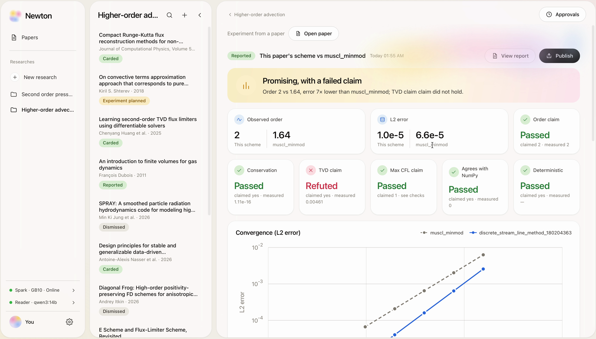

# Newton

Newton is a long-running research agent for computational scientists: give it a research topic and it keeps watching arXiv, reads each new paper with a model running on your own hardware, and extracts the numerical method and the claims the paper makes. It turns that method into a typed, safe specification and proposes an experiment against a baseline, which runs on your GPU (an NVIDIA GB10 / DGX Spark over SSH, or the Mac's Apple GPU) only after you approve it. Every result says which claims hold and which don't, with the checks, convergence plots and full provenance, and can be published to GitHub after a second approval. It is a macOS desktop app (Tauri + React) on a local engine (FastAPI + SQLite) that survives restarts, retries when the network or the GPU box is down, and never runs or publishes anything without your OK.



```bash
git clone https://github.com/tihiera/newton.git
cd newton
scripts/setup.sh   # once: the Python env (uv) and the UI packages; needs macOS 14+, git, Node.js 20.19+ or 22.12+
scripts/run.sh     # starts Newton: the desktop window (with Rust), else the browser
# requirements, GPU hosts and development: docs/setup.md
```
